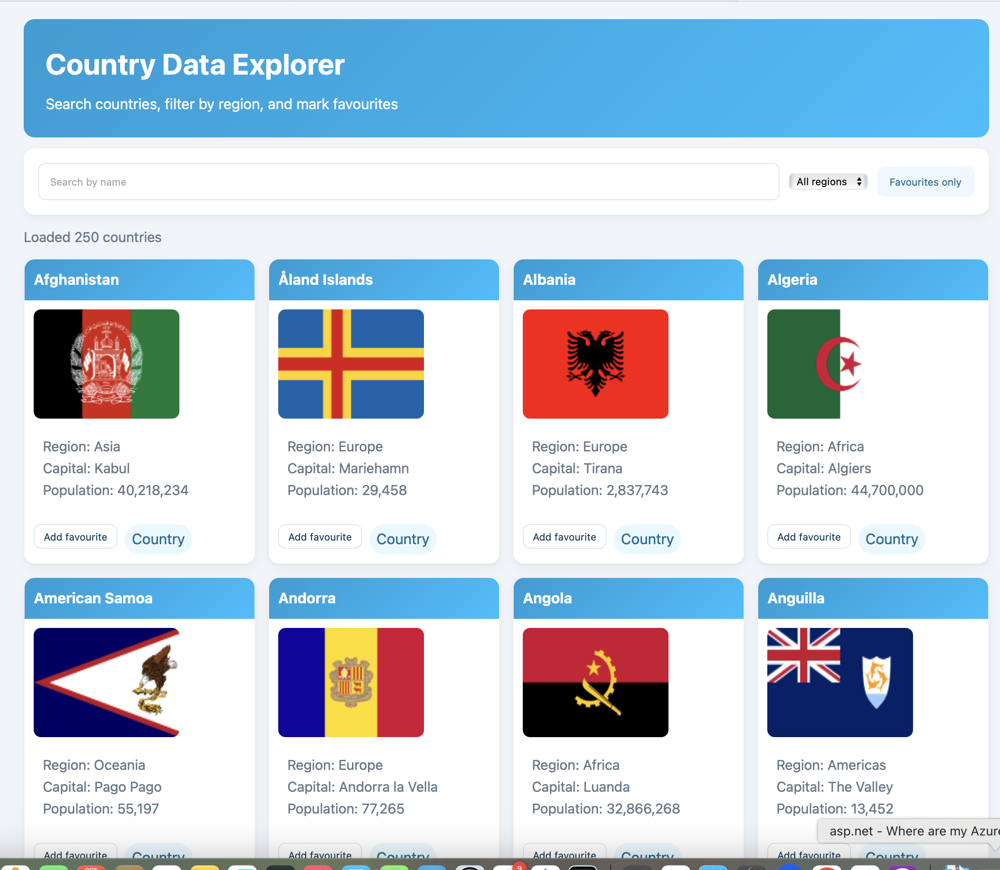

# Country Data Explorer

Single-page web app for browsing country data powered by the REST Countries API. Search by name, filter by region, and curate a personal list of favourites stored in `localStorage`.

## Features

- Instant search with debounced input for country names.
- Region dropdown filter and favourites-only toggle.
- Lightweight country cards showing flag, capital, and population.
- Favourite state persisted locally between sessions.

## Getting Started

1. Clone or download this repository.
2. Serve the project root with any static server, for example:
   ```bash
   npx serve .
   ```
3. Open `http://localhost:3000` (or the reported URL) in a modern browser.

> Opening `index.html` directly from the file system also works in most browsers because the app only issues HTTPS requests to the REST Countries API.

## Usage

- Type in the **Search by name** field to narrow results.
- Use the **All regions** dropdown to focus on a specific region.
- Toggle **Favourites only** to switch between all countries and saved favourites.
- Press **Add favourite** on a card to save it; press **Remove favourite** to clear it.

## Screenshots




## Project Structure

| Path        | Description                                    |
|-------------|------------------------------------------------|
| `index.html`| Entry point with layout scaffolding            |
| `styles.css`| Core styling for cards and layout              |
| `app.js`    | Fetches data, handles filtering, favourites    |

## Data Source

Country data comes from [restcountries.com](https://restcountries.com). Each card uses `cca2` codes to load flag images from [flagcdn.com](https://flagcdn.com).

## Self Reflection

Working on Country Data Explorer pushed me to treat a static website as a full product rather than just markup stitched together. I designed the layout in plain HTML and CSS, then wired up the controls in vanilla JavaScript so search, region filtering, and favourites all feel instant. Fetching live data from the REST Countries API forced me to think about loading states, error handling, and how to normalize JSON into something the UI can consume. I also learned to lean on `localStorage` for persisting favourites so the page feels personal even without a backend. Refactoring the card rendering into small helper functions made the code easier for future me to revisit.

Beyond the browser, I practiced a proper build-and-release loop. I opened incremental commits that described the UI work, pushed them to GitHub, and used pull request previews to sanity check rendering on different devices. Publishing with GitHub Pages gave me experience with static hosting quirks like relative asset paths and cache busting, and I documented those lessons in the README so someone else can deploy quickly. Going forward I want to automate the workflow with a simple CI job that runs linting and maybe a Lighthouse report so regressions are easier to catch. Overall this project demystified the path from idea to a live web app that anyone can bookmark.

## Future Ideas

- Add pagination or infinite scroll for large result sets.
- Expose more filters (population range, subregion, languages).
- Cache API results to reduce re-fetching on repeat visits.
